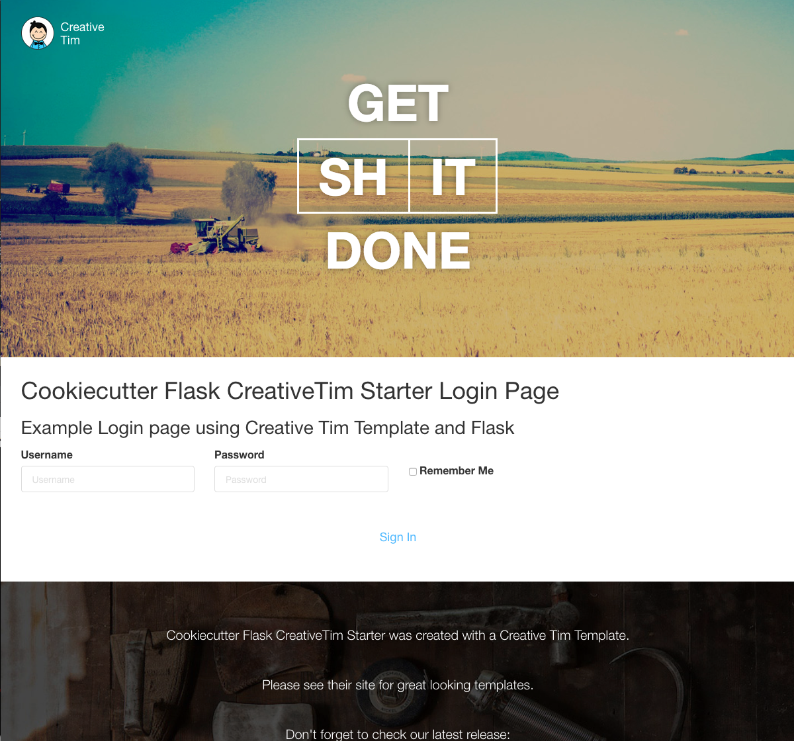
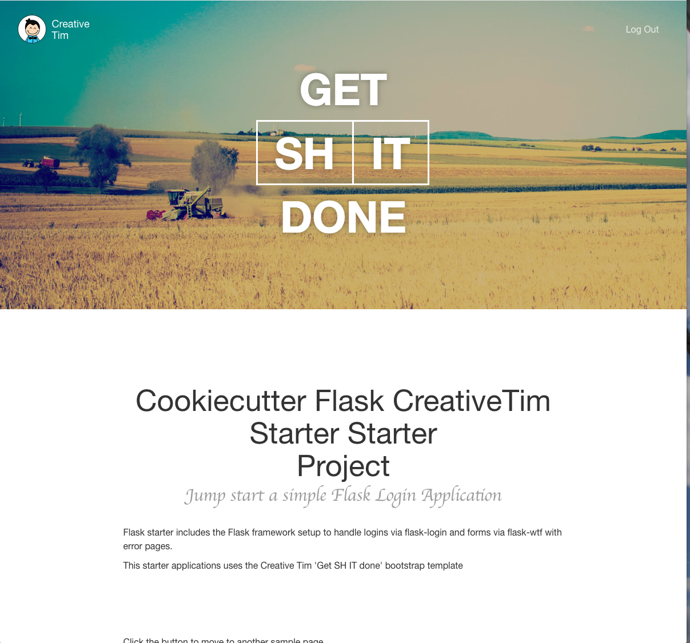

Flask Creative Tim Starter
==========================

A cookiecutter template that will create a starter Flask and CreativeTim project.

Requirements
------------
Install `cookiecutter` command line: `pip install cookiecutter`    

Usage
-----
Generate a new Cookiecutter template layout: `cookiecutter gh:youngsoul/cookiecutter-flask-creative-tim-starter`    

Example Views
-------------

License
-------
This project is licensed under the terms of the [MIT License](/LICENSE)
